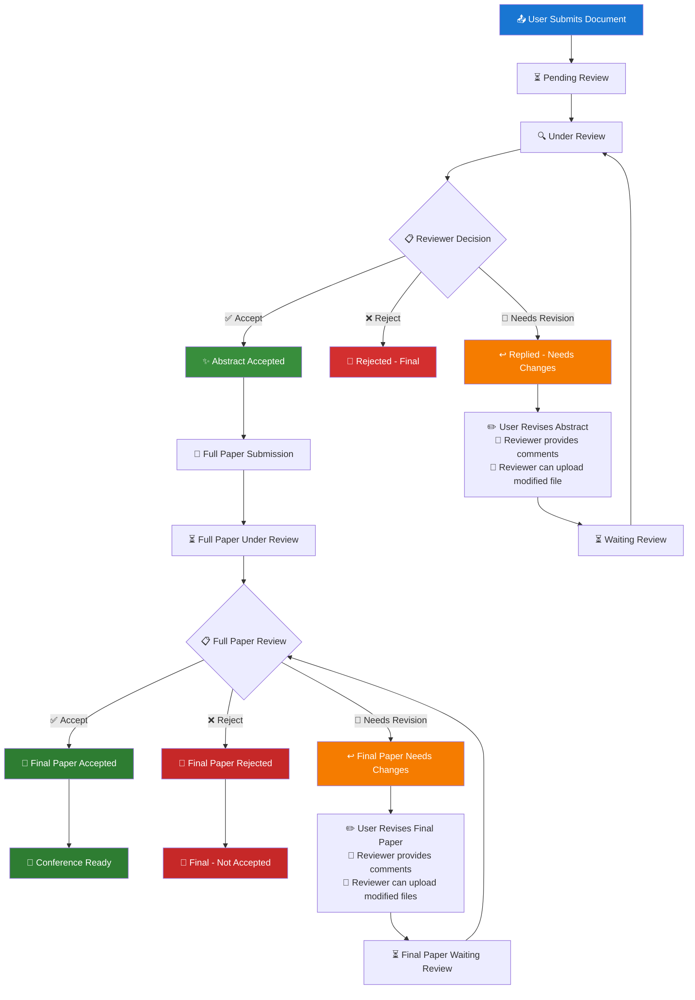

# 🎓 Full-Stack Conference Site

> A comprehensive conference management platform for the 2025 Conference on Biomechatronics Engineering and Agricultural Machinery

[](https://beame2025.cc/)


## ✨ Project Overview

This is a sophisticated **full-stack conference management platform** specifically developed for the **2025 Conference on Biomechatronics Engineering and Agricultural Machinery** (2025 年生機與農機學術研討會). Currently deployed at **[beame2025.cc](https://beame2025.cc/)**.

### 🎯 Complete Conference Lifecycle Management

This **end-to-end full-stack solution** handles every aspect of conference management:

```
📢 Announcements → 👤 Registration → 💳 Payment → 📄 Submission →
🔍 Review Process → ✅ Acceptance → 📱 QR Check-in → 🎉 Event Completion
```

**📋 Full Business Process Coverage:**

- **📢 Information Publishing**: Dynamic announcements, important dates, speaker information with **real-time admin panel editing** - organizers can manage all content directly from the frontend without backend access. **This is a solution designed for non-technical event organizers.**
- **👥 User Registration**: Google OAuth authentication with multi-role management
- **💳 Payment Processing**: Automated ECPay integration with time-based pricing (early bird, regular, on-site)
- **📄 Document Submission**: PDF/Word upload with real-time preview and validation
- **🔍 Document Review System**: Two-stage review workflow (abstract → full paper) with revision cycles
- **📧 Communication Hub**: Automated email notifications for every workflow transition
- **📱 Event Management**: QR code-based check-in system for on-site attendance tracking
- **📊 Administrative Control**: Comprehensive admin dashboard for user, payment, and submission management

## 🎨 Platform Screenshots

### 🏠 Public Interface


_Dynamic homepage with conference information, announcements, and speaker details_

### 👤 User Dashboard


_Personal dashboard for document submission, payment status, and review tracking_

### 🔍 Review System


_Comprehensive reviewer interface with document preview and batch operations_

### ⚙️ Admin Panel


_Non-technical admin panel for content management, user roles, and system configuration_

> **Note**: Screenshots showcase the live system currently serving [beame2025.cc](https://beame2025.cc/)

## 🚀 Key Technical Achievements

- **Multi-role Authentication System** with granular permissions
- **Complex Document Review Workflow** with status management
- **Third-party Payment Integration** (ECPay) with dynamic pricing
- **Real-time QR Code Check-in System** for event management
- **Automated Email Notification System** with custom templates
- **PDF Document Processing & Preview** capabilities
- **RESTful API Design** with 30+ endpoints and custom middleware

## 🏗️ System Architecture

### Tech Stack

```
Frontend:    Next.js 15 + React 19 + TypeScript + Tailwind CSS
Backend:     Next.js API Routes + Custom Middleware Factory
Database:    MongoDB with complex relational data schema
Auth:        NextAuth.js + Google OAuth 2.0
Payment:     ECPay (Taiwan payment gateway)
UI/UX:       Radix UI + shadcn/ui + Custom Components
DevOps:      Docker + Docker Compose + CloudFlare Tunnel
Email:       Nodemailer + HTML Templates
PDF:         PDF.js + Mammoth.js
```

### Core Components Architecture

```
┌─────────────────────────────────────────────────────────────┐
│                     Frontend (Next.js)                      │
│  ┌─────────────┐  ┌──────────────┐  ┌─────────────────┐     │
│  │   Public    │  │   Profile    │  │  Admin/Reviewer │     │
│  │   Pages     │  │  Dashboard   │  │    Dashboard    │     │
│  └─────────────┘  └──────────────┘  └─────────────────┘     │
└─────────────────────────┬───────────────────────────────────┘
                          │
┌─────────────────────────┴───────────────────────────────────┐
│                   API Layer (30+ Routes)                    │
│  ┌─────────────┐  ┌──────────────┐  ┌─────────────────┐     │
│  │  Auth API   │  │ Document API │  │  Payment API    │     │
│  │ (NextAuth)  │  │ (Upload/Rev) │  │    (ECPay)      │     │
│  └─────────────┘  └──────────────┘  └─────────────────┘     │
└─────────────────────────┬───────────────────────────────────┘
                          │
┌─────────────────────────┴───────────────────────────────────┐
│              Database & External Services                   │
│  ┌───────────────┐  ┌──────────────┐  ┌─────────────────┐   │
│  │   MongoDB     │  │  File System │  │  Email Service  │   │
│  │ (Documents,   │  │   (Uploads)  │  │  (Nodemailer)   │   │
│  │Users,Payments)│  │              │  │                 │   │
│  └───────────────┘  └──────────────┘  └─────────────────┘   │
└─────────────────────────────────────────────────────────────┘
```

## 🎯 Core Features

### 👥 Multi-Role Permission System

- **Attendees**: Registration, document submission, payment
- **Reviewers**: Paper review, status management, batch operations
- **Admins**: User management, system configuration, analytics
- **Helpers**: Check-in assistance, manual operations

### 📄 Document Management & Review Workflow



**Key Features:**

- **Automated Email Notifications** 📧 sent at every state transition
- **Two-Stage Review Process**: Abstract → Full Paper review
- **Revision Loops**: Both stages support multiple revision cycles
- **Interactive Review System**: Reviewers can provide written comments and upload modified documents
- **PDF/Word document upload** with validation and preview
- **Reviewer Dashboard Integration** with real-time status updates
- **Reviewer Whitelist System** for targeted assignment
- **Status Tracking** with instant notifications to all stakeholders

### 💳 Dynamic Payment System

- **Time-based pricing**: Early bird → Regular → On-site rates
- **Category-based pricing**: Member, Non-member, Student rates
- **ECPay integration** with automatic status verification
- **Manual payment processing** for admin users

### 📧 Smart Notification System

- Template-based email system with dynamic content
- Event-driven notifications (payment confirmation, status updates)
- Multi-language support (Traditional Chinese)

## 🛠️ API Architecture Highlights

### Custom Middleware Factory

Implemented a reusable middleware system for consistent API behavior:

```typescript
middlewareFactory(
  {
    cors: true,
    auth: true,
    role: ["admin", "reviewer"],
  },
  handler
);
```

### Route Organization (30+ endpoints)

```
/api/
├── auth/              # Authentication (NextAuth)
├── attendee/          # User-specific operations
├── admin/             # Administrative functions
├── reviewer/          # Review system
├── payment/           # Payment processing
├── documents/         # File management
├── info/              # Public information
└── helpers/           # Utility functions
```

### Key Technical Implementations

- **Type-safe API responses** with TypeScript interfaces
- **Comprehensive error handling** with standardized responses
- **Session-based authorization** with role-based access control
- **CORS handling** for secure cross-origin requests

## 📊 Data Models

### Core Collections

- **Users**: Profile data, roles, payment status
- **Documents**: File metadata, review status, annotations
- **Submissions**: Review workflow tracking
- **Payments**: Transaction records with ECPay integration
- **Announcements**: Dynamic content management
- **PaymentOptions**: Time-based pricing configuration

## 🚀 Quick Deployment

### Prerequisites

- Docker & Docker Compose
- Google OAuth credentials
- ECPay merchant account (optional for payments)
- SMTP email service credentials

### Easy Setup

```bash
# 1. Clone the repository
git clone https://github.com/brian033/bmesite
cd bime_conf

# 2. Populate required directories
mkdir uploads db

# 3. Configure environment variables
cp env_example.txt .env
# Fill in your configuration values

# 4. Start the application
docker-compose -f docker-compose.prod.yml --env-file .env up --build -d
```

### Database Initialization

The system includes pre-configured data in `basic_datas/`:

- **Payment options** with time-based pricing
- **System announcements** and important dates
- **Default configuration** for immediate deployment

Import initial data:

```bash
# Import payment options
docker exec mongo mongoimport --db confDb --collection paymentOptions --file /app/basic_datas/confDb.paymentOptions.json

# Import announcements
docker exec mongo mongoimport --db confDb --collection announcements --file /app/basic_datas/confDb.announcements.json

# Import important dates
docker exec mongo mongoimport --db confDb --collection importantDates --file /app/basic_datas/confDb.importantDates.json
```

Or use MongoDB Compass to load data with interactive ui

## 🌟 Development Highlights

### Problem-Solving Approach

- **Complex State Management**: Implemented custom hooks for document workflow states
- **Payment Security**: Implemented ECPay hash verification and webhook handling
- **UI/UX Consistency**: Created reusable component library with Radix UI

### Performance Optimizations

- **Server-side Rendering** with Next.js for optimal SEO
- **Image Optimization** with Next.js built-in features
- **Database Indexing** for efficient query performance
- **Containerized Deployment** for consistent environments
- **Cloudflare tunnel support** no need to configure Firewall settings

## 📈 Business Impact

- Currently serving the **2025 Conference on Biomechatronics Engineering and Agricultural Machinery**
- Handling **100+ user registrations** and document submissions
- Processing **conference fees** through automated payment system
- Reducing administrative workload through workflow automation

## 👨‍💻 Developer Information

**Project Background**: Specifically developed for the 2025 年生機與農機學術研討會 (2025 Conference on Biomechatronics Engineering and Agricultural Machinery), this project demonstrates expertise in building enterprise-level applications with complex business logic and third-party integrations. Currently deployed and actively serving the conference community at [beame2025.cc](https://beame2025.cc/).

**Key Learning Outcomes**:

- Advanced Next.js 15 features and optimizations
- Complex state management in React applications
- Database design for document workflow systems
- Third-party API integration (Payment gateways, OAuth)
- Docker containerization and deployment strategies

**Live Demo**: Visit [beame2025.cc](https://beame2025.cc/) to see the platform in action.

---
